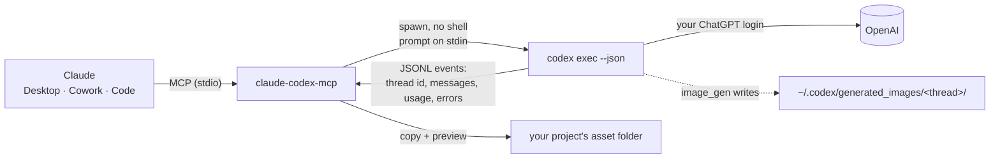

<div align="center">

# claude-codex-mcp

**Let Claude hand work to OpenAI Codex — code tasks, second opinions and image assets — on the ChatGPT/Codex subscription you already pay for.**

[](https://github.com/aikazu/claude-codex-mcp/actions/workflows/ci.yml)
[](LICENSE)


[English](README.md) · [Bahasa Indonesia](README.id.md)

</div>

`claude-codex-mcp` is a small [MCP](https://modelcontextprotocol.io) server that drives the official **Codex CLI** (`codex exec`) on your machine. Claude gets five tools: delegate a task, generate images with Codex's built-in `image_gen`, poll/cancel jobs, and list models. No OpenAI API key, no token scraping, no third-party service — just the CLI you are already logged into.

It works in **Claude Desktop** (Chat and Cowork) and **Claude Code**, and it was built Windows-first.

```text
You:    Ask Codex to review the auth module read-only, then fix what you both agree on.
Claude: → codex_task { cwd: "D:\\work\\shop", sandbox: "read-only", model: "gpt-6-astra", reasoning_effort: "xhigh" }
        ← 3 findings, session_id 01a1…   (Claude verifies them, applies the fix, runs the tests)

You:    Make 4 transparent gold-coin icons for the HUD.
Claude: → codex_image { prompt: "...", count: 4, transparent: true, out_dir: "D:\\work\\game\\assets\\icons" }
        ← coin.png, coin-2.png, coin-3.png, coin-4.png + previews
```

## Features

- **Delegation** — `codex_task` runs a full Codex agent turn in a folder you choose, returns its final message and a `session_id` to continue the same Codex thread.
- **Image assets** — `codex_image` uses Codex's built-in GPT Image tool, copies results into your project (never overwriting), supports transparent backgrounds and reference images, and returns previews so Claude can check them.
- **Model choice** — `codex_models` reads the live catalog for *your* account; pick any `model` and `reasoning_effort` (`low` … `ultra`) per call.
- **Never blocks the client** — calls wait up to `wait_seconds` (default 50 s) and then hand back a `job_id`; progress notifications keep long calls alive. Image jobs are serialized so outputs are attributed to the right job.
- **Safe defaults** — `workspace-write` sandbox (or `read-only`), network off unless asked, no `danger-full-access`. Prompts go over stdin and nothing ever passes through a shell.
- **Zero runtime dependencies** — plain Node ≥ 20. Easy to audit: about 1,000 lines in [`src/`](src).

## How it works



Codex CLI ≥ 0.160 no longer ships `codex mcp-server`, so this project wraps the supported non-interactive entry point, `codex exec`, and reads its `--json` event stream.

## Requirements

- **Node.js 20+**
- **Codex CLI**, logged in with your ChatGPT account: `npm i -g @openai/codex` (or the Codex desktop app's bundled CLI), then `codex login`
- A ChatGPT plan that includes Codex. Usage counts against your Codex limits; image generation uses them faster than text.

## Install

### Option A — Claude Code plugin

```text
/plugin marketplace add aikazu/claude-codex-mcp
/plugin install codex-mcp@aikazu
```

This adds the MCP server plus a `codex-delegation` skill that teaches Claude when delegation is worth it and how to brief Codex.

### Option B — Claude Desktop / Cowork (and Claude Code)

```bash
git clone https://github.com/aikazu/claude-codex-mcp.git
cd claude-codex-mcp
```

Windows (PowerShell):

```powershell
powershell -ExecutionPolicy Bypass -File .\scripts\install.ps1
```

macOS / Linux:

```bash
./scripts/install.sh
```

The installer checks Node and your Codex login, then registers the server as `codex` in every `claude_desktop_config.json` it finds (standard and Microsoft Store installs, with a timestamped backup) and in Claude Code (`claude mcp add -s user`). It pins absolute paths for `node` and `codex`, because GUI apps often start MCP servers with a minimal `PATH`. Fully quit and reopen Claude Desktop afterwards.

Options: `-AssetDir <dir>` / `--asset-dir`, `-Sandbox read-only` / `--sandbox`, `-TaskModel` / `--task-model`, `-TaskEffort` / `--task-effort`, `-ImageModel` / `--image-model`, `-ImageEffort` / `--image-effort`, `-DryRun` / `--dry-run`, `-Uninstall` / `--uninstall`.

### Option C — manual config

```json
{
  "mcpServers": {
    "codex": {
      "command": "C:\\Program Files\\nodejs\\node.exe",
      "args": ["C:\\Users\\you\\Tools\\claude-codex-mcp\\src\\cli.mjs"],
      "env": { "CODEX_BIN": "C:\\Users\\you\\AppData\\Local\\Programs\\OpenAI\\Codex\\bin\\codex.exe" }
    }
  }
}
```

```bash
claude mcp add codex -s user -- node /path/to/claude-codex-mcp/src/cli.mjs
```

Check the setup at any time:

```bash
node src/cli.mjs --check
```

## Tools

| Tool | What it does | Key arguments |
|---|---|---|
| `codex_task` | Run a Codex agent turn in `cwd` | `prompt`, `cwd`, `sandbox`, `model`, `reasoning_effort`, `images`, `add_dirs`, `network`, `session_id`, `wait_seconds` |
| `codex_image` | Generate images with Codex `image_gen` | `prompt`, `out_dir`, `name`, `count` (1–8), `size`, `transparent`, `reference_images`, `model`, `return_images` |
| `codex_job` | Wait for, fetch or cancel a job | `job_id`, `wait_seconds`, `cancel` |
| `codex_jobs` | List recent jobs | — |
| `codex_models` | Models available to your account + configured default | `include_hidden` |

Results are JSON with `status` (`queued` · `running` · `completed` · `failed` · `cancelled`), `final_message`, `session_id`, `usage`, `files` (images), `changed_files` (workspace-write tasks in a git repository: absolute paths whose git status or mtime changed during the run), `warnings` (e.g. a requested transparent image without alpha), and `errors` / `stderr_tail` on failure.

## Things to ask Claude

- "Show me `codex_models`, then ask the strongest one to review this PR's diff, read-only."
- "Delegate to Codex: add unit tests for `src/payments`, then review its diff and run the tests yourself."
- "Start Codex on the migration in the background and keep working on the UI; check back when it's done."
- "Generate a 16:9 key art for the README with Codex, save it to `docs/`."

## Configuration

Environment variables (set them in the MCP server entry):

| Variable | Default | Meaning |
|---|---|---|
| `CODEX_BIN` | auto-detect | Path to `codex.exe`, the `codex` binary, or `@openai/codex/bin/codex.js` |
| `CODEX_HOME` | `~/.codex` | Codex home (auth, config, `generated_images`) |
| `CODEX_MCP_SANDBOX` | `workspace-write` | Default sandbox for `codex_task` (`read-only` or `workspace-write`) |
| `CODEX_MCP_ASSET_DIR` | `~/Pictures/codex-assets` | Default `out_dir` for images |
| `CODEX_MCP_TASK_MODEL` / `CODEX_MCP_TASK_EFFORT` | Codex `config.toml` | `model` / `reasoning_effort` for `codex_task` calls that omit them |
| `CODEX_MCP_IMAGE_MODEL` / `CODEX_MCP_IMAGE_EFFORT` | Codex `config.toml` | Same for `codex_image`; a fast model at `low` is enough, the agent only drives image_gen |
| `CODEX_MCP_WAIT` | `50` | Default seconds a call waits before returning a `job_id` (max 240) |
| `CODEX_MCP_MAX_TASKS` | `3` | Concurrent `codex_task` runs; extra jobs queue |
| `CODEX_MCP_MAX_IMAGES` | `1` | Concurrent image jobs (keep 1 for reliable attribution) |
| `CODEX_MCP_PREVIEW_MAX_BYTES` | `1500000` | Largest image embedded as a preview |
| `CODEX_MCP_PREVIEW_MAX_COUNT` | `4` | Previews per result |

## Security model

- The server is a local stdio process; it opens no ports and stores no credentials. Authentication is entirely the Codex CLI's own login.
- Codex runs under its own sandbox: `read-only` or `workspace-write` (writes limited to `cwd` plus `add_dirs`, network off unless `network: true`). The bypass/full-access modes are intentionally not exposed.
- Arguments are passed as an argv array without a shell; prompts go over stdin. `model`, `reasoning_effort` and `session_id` are validated against strict patterns before they reach Codex.
- Treat Codex output as untrusted input. The bundled skill tells Claude to verify claims and diffs before relaying them.

See [SECURITY.md](SECURITY.md) for reporting.

## How it compares

There are good projects in this space; each covers part of it. As of October 2026:

| Project | Kind | Delegation | Images | Claude Desktop / Cowork | Windows | Notes |
|---|---|:-:|:-:|:-:|:-:|---|
| **claude-codex-mcp** | MCP server | ✓ | ✓ | ✓ | ✓ (primary) | async jobs, model catalog, sandboxed, 0 deps |
| [Sateezg/codex-bridge](https://github.com/Sateezg/codex-bridge) | Claude Code plugin | ✓ | ✓ | — | not tested | rich set of skills and subagents |
| [cexll/codex-mcp-server](https://github.com/cexll/codex-mcp-server) | MCP server | ✓ | — | ✓ | ✓ | ask-codex + brainstorm tools |
| [kky42/codex-as-mcp](https://github.com/kky42/codex-as-mcp) | MCP server | ✓ | — | ✓ | — | parallel agents; runs Codex with sandbox bypassed |
| [glassd/Pixmith](https://github.com/glassd/Pixmith) | MCP server | — | ✓ | ✓ | ✓ | image-focused, async jobs |
| [ShalomObongo/codex-imagegen-mcp](https://github.com/ShalomObongo/codex-imagegen-mcp) | MCP server | — | ✓ | ✓ | — | calls the ChatGPT backend directly with `auth.json` tokens |

Pick whatever fits; this one aims to be the single, auditable server that covers both jobs everywhere Claude runs.

## Troubleshooting

| Symptom | Fix |
|---|---|
| `Codex CLI not found` | Install Codex, or set `CODEX_BIN`. On Windows point it at `codex.exe` or `…\node_modules\@openai\codex\bin\codex.js` — `.cmd` shims cannot be spawned safely. |
| `Not logged in` | Run `codex login` and sign in with ChatGPT. |
| Tools don't appear in Claude Desktop | Quit from the tray / menu bar (closing the window is not enough) and reopen. Check the app's MCP logs. |
| Calls return `running` | Normal for long runs; Claude polls with `codex_job`. Raise `CODEX_MCP_WAIT` if your client allows long tool calls. |
| `usage limit` errors | Your Codex quota is spent; it resets on your plan's schedule. |
| Codex reports `CreateProcessWithLogonW failed: 267` (Windows) | Codex's `workspace-write` sandbox could not start a shell in `cwd`. Seen with folders under `AppData\Roaming`; use a project folder elsewhere, or `read-only`. |
| No image found after a job | Make sure the job wasn't cancelled and that `CODEX_HOME` matches the Codex install that ran. |

## Development

```bash
npm install        # dev tooling only (Biome)
npm test           # node:test suite, runs against a fake Codex CLI
npm run lint
node src/cli.mjs --check
```

The test suite never calls OpenAI: [`test/fixtures/fake-codex.mjs`](test/fixtures/fake-codex.mjs) mimics `codex exec --json`, `debug models` and `login status`. CI runs it on Windows, macOS and Linux and validates the plugin manifests.

## Disclaimer

Independent project, not affiliated with OpenAI or Anthropic. It only automates the official Codex CLI on your own machine with your own account; you remain responsible for complying with the terms of your ChatGPT/Codex plan.

## License

[MIT](LICENSE) © Iqbal Attila
